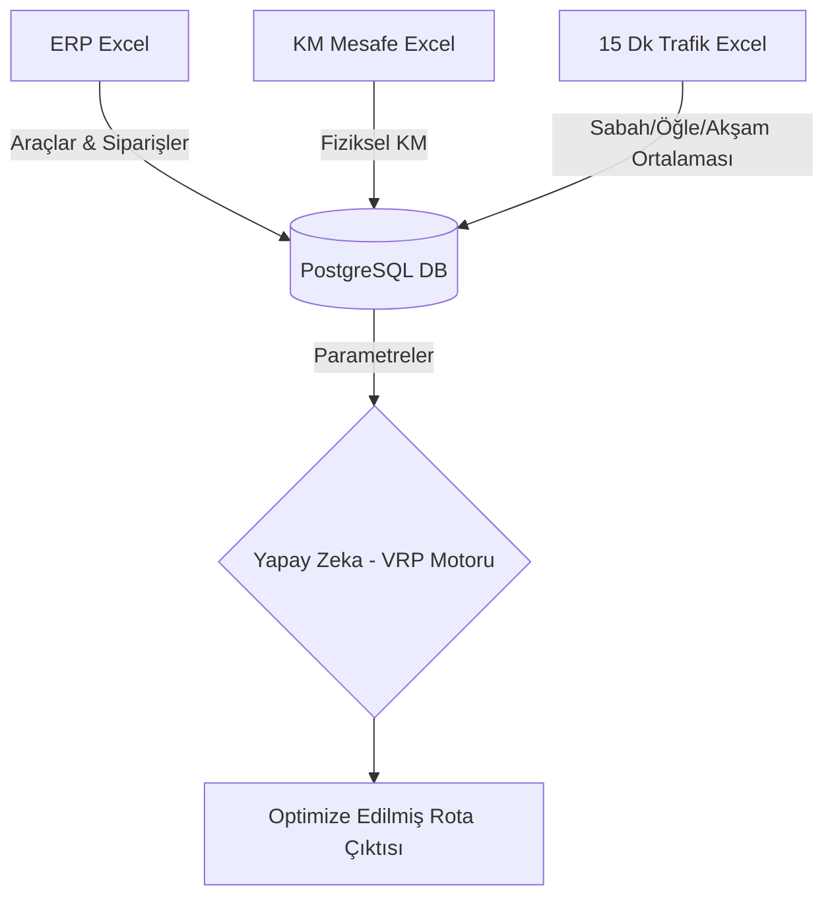

# Uyumsoft Rota Optimizasyon Sistemi - Analiz Dokümanı

> [!NOTE]
> Bu doküman, iş analistleri ve sistem geliştiricileri için Rota Optimizasyon (VRP) motorunun baştan uca çalışma mantığını, kısıtlarını ve veri akışını özetlemektedir.

## 1. Veri Akışı ve ETL Süreci (Extract, Transform, Load)

Sistem, günlük operasyonlarda kullanıcı dostu olması amacıyla dışarıdan Excel dosyaları ile beslenir ve bu verileri PostgreSQL veritabanına aktarır.

1. **ERP Verileri (`ERP_EXCEL_PATH`):** Araç kapasiteleri, müşteri talepleri (kg/m3), cari kartlardaki mal kabul saatleri (zaman pencereleri) ve bölge/yaka kısıtları sisteme alınır.
2. **Mesafe Matrisi (`MATRIX_EXCEL_PATH`):** Tüm lokasyonlar (depo ve müşteriler) arasındaki mutlak fiziksel uzaklıkları (KM) içerir. Sadece nihai raporlama amacıyla kullanılır, rotanın maliyetine (cost) doğrudan etki etmez.
3. **Trafik Süre Matrisi (`TRAFFIC_EXCEL_PATH`):** 15 dakikalık periyotlar halinde (Örn: 08:00-08:15) hazırlanmış devasa matris okunur. Sistem bu karmaşık veriyi veritabanına kaydederken 3 ana bloğa indirger:
   - **Sabah Trafiği:** 10:00'a kadar olan sürelerin ortalaması
   - **Öğle Trafiği (Sakin):** 10:00 - 16:00 arası sürelerin ortalaması
   - **Akşam Trafiği:** 16:00 sonrası sürelerin ortalaması

## 2. Optimizasyon Kısıtları (Constraints)

Google OR-Tools tabanlı matematiksel model, aşağıdaki kısıtların **tamamını aynı anda** sağlayacak rotalar üretir. Bir kısıt bile ihlal ediliyorsa çözüm "Geçersiz" sayılır veya kısıtı bozan müşteri rotadan çıkarılır (Penalty).

### A. Çoklu Kapasite Kısıtı (Weight & Volume)
Her aracın taşıyabileceği Maksimum Ağırlık (Kg) ve Maksimum Hacim (m3) `arac_kartlari` tablosundan çekilir. Müşteri siparişleri toplanarak araca yüklenir. **Hem ağırlık hem hacim limitleri eş zamanlı** olarak denetlenir.

### B. Bölge / Yaka Geçiş İzni
İstanbul gibi metropollerde araçların köprü kullanma izinleri değişebilir. 
- Müşterinin ve Deponun Yaka Bilgisi (Avrupa/Anadolu) `cari_kart` içerisinden çekilir.
- Eğer bir aracın "Sadece Avrupa" izni varsa, yapay zeka bu aracı kesinlikle Anadolu yakasındaki bir müşteriye atamaz.

### C. Mal Kabul Saatleri (Time Windows - VRPTW)
Her müşterinin mal kabul başlangıç ve bitiş saatleri vardır. (Örn: CAR001 için 08:00 - 12:00)
- Sistem zamanı **"Mutlak Dakika"** cinsinden takip eder. (Gece 00:00 = 0, Sabah 08:00 = 480).
- Araç müşteriye saat 07:00'da varırsa, teslimat yapamaz. **08:00'a kadar (60 dk) kapıda bekler.** Bu bekleme süresi şoförün toplam mesaisine etki eder.

### D. Maksimum Durak ve Mesai Limiti
Şoförlerin yasal çalışma sınırlarını korumak için iki limit bulunur:
- **Max Stops:** Bir araç günde en fazla X noktaya uğrayabilir.
- **Max Time:** Bir araç günde en fazla Y dakika (aktif sürüş + hizmet) çalışabilir.

> [!IMPORTANT]
> **Bekleme Süresi ile Sürüş Süresi Farkı:** Şoför trafiğe takılırsa aktif sürüş süresi (Max Time) dolar. Ancak kapıda mal kabul saatini beklerse, bu bekleme süresi "Aktif Mesai (Time Callback)" içerisine değil, "Toplam Rota Süresi (CumulVar)" içerisine sayılır. Bu sayede şoför dinlenirken ceza puanı yemez.

## 3. Optimizasyonun Hedef Fonksiyonu (Objective/Cost)

Yapay zeka algoritması rotayı çizerken **"Neyi en aza indirmeliyim?"** sorusunun cevabını arar. Bizim sistemimizde ana hedef **KM değil, Trafik Süresidir!**

1. Algoritma A noktasından B noktasına gitmek ister.
2. O anki "Mutlak Zaman" (Örn: 17:30 = 1050. dakika) kontrol edilir.
3. Saat 17:30 olduğu için algoritma fiziksel mesafeye değil, **"Akşam Trafiği" matrisindeki dakika süresine** bakar.
4. Çevreyolundan gitmek KM olarak uzun olsa da, trafik matrisinde daha kısa dakika verdiği için algoritma uzun ama hızlı olan yolu tercih eder.
5. Depo harici her durağa varıldığında, mal indirme işlemi için sabit **15 dakika "Hizmet Süresi"** (Service Time) eklenir.

> [!TIP]
> Çıktıda (Konsolda) gördüğünüz **Toplam Süre**; yoldaki sürüş süresini, kapıdaki 15 dakikalık indirme süresini ve (varsa) müşterinin mal kabul saatinin başlaması için kapıda beklenen ölü zamanı **kapsar**. Ekrana yazılan **Toplam Katedilen Mesafe** ise sadece bilgilendirme amaçlıdır.
